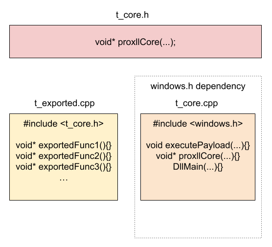

## What is and how to use Proxll
Releasing a proxy DLL generator in almost 2025 is coming a bit late to the game, I know. But I decided to make my own implementation for fun and learning as well as taking the opportunity to talk about a common problem while designing a proxy DLL application in C++.

I'll go into a bit more detail below about what problem I'm talking about, but for those who want to skip that part, Proxll is used in the following way:

#### 1- Locate the proxy DLL oportunity
The first step is to identify a situation where DLL proxying is useful. For this, I recommend using both [Process Monitor](https://learn.microsoft.com/es-es/sysinternals/downloads/procmon) and [API Monitor](http://www.rohitab.com/apimonitor).

#### 2- Compile ProxllGen.exe
Proxll needs to be compiled using **x86_64-w64-mingw32-g++** so MinGW for 64-bit installed it's needed. Once installed, Proxll has a makefile to facilitate compilation. Simply run **mingw32-make.exe** in the project folder to build..
```
D:\Proxll\proxllGen> mingw32-make.exe
[*] Compiling proxllGen.exe (x64)
[+] ProxllGen compiled at \proxllGen\bin
```

#### 3- Generate a proxy DLL template using ProxllGen.exe
The next step is to generate a template of the legitimate DLL we want to proxy, to do it, we execute the following command:
```
proxllGen.exe <DLL absolute path> <function name>
```

```
D:\Proxll\proxllGen\bin> proxllGen.exe C:\Windows\System32\version.dll GetFileVersionInfoA
[+] Template generated at \Proxll\template
```

*Note: the path of the DLL must be the same as on the target machine and the function name can be ```DllMain```*

The execution of the command will leave the following relevant files in the ```\template``` folder:

|  File                   | Description                                                                                                                                    |
| ----------------------- | ---------------------------------------------------------------------------------------------------------------------------------------------- |
| t_core.cpp              | Contains the functions that have dependencies on the Windows API as well as the function that will run the malicious code
| /include/t_core.h       | Defines the prototype of the function that executes the malicious code, making it accessible from ```t_exported.cpp```. (More details in the TL;DR section.)
| t_exported.cpp          | Contains the definition of the exported functions from the legitimate DLL 
| exported.def            | .def file used to link the functions defined in ```t_exported.cpp``` to those in the legitimate DLL 

#### 4- Proxy DLL compilation
Once the template has been generated and the code we want to run has been added, the proxy DLL can be compiled using **mingw32-make.exe** in the ```\template``` folder.

```
D:\Proxll\template> mingw32-make.exe
[*] Compiling proxy DLL (x64)
[+] Proxy DLL generated at \template\bin
```
  
## TL;DR Proxy DLL & Proxll approach
In this section, I’ll explain what a proxy DLL is. If you're already familiar with the concept, feel free to skip ahead.

In general terms, a proxy DLL is a DLL whose functions act as an intermediary (or "front end") for functions defined in another DLL. This may sound unusual, but it's something the operating system itself does in various contexts.

An example of legitimate use can be seen in forwarded exported functions. In the following example we can see how the ```VerLanguageNameA``` and ```VerLanguageNameW``` functions of ```C:\Windows\System32\version.dll``` points to the memory address to their equivalents in ```KERNEL32.dll```.


While this is legitimate, anything poorly implemented can become a problem. As a simple example of this casuistry, let's assume the following case of a program looking for a DLL in two potential locations:
```c++
HMODULE hLegitDll = LoadLibrary("C:\\Programs\\LegitApp\\dll\\legit.dll");
if(hLegitDll == NULL){
	hLegitDll = LoadLibrary("C:\\Programs\\LegitApp\\legit.dll");
	if(hLegitDll == NULL){
		//Error handling
	}
}
```

If ```legit.dll``` is in the second location, we find the following in Process Monitor:


If a malicious user had write permissions on the first path, he could deploy a DLL named ```legit.dll``` and execute code via the ```legitApp``` process. But what would happen to legitApp? Well, it would crash sooner or later due to several factors.

Let's assume that the ```legitApp``` process makes the following call after the DLL is loaded:
```c++
pLegitExportedFunc3 exportedFunc = (pLegitExportedFun3)GetProcAddress(hLegitDll, "legitExportedFunc3");
if(exportedFunc == NULL){
	//Error handling
}

size_t c = 0;
exportedFunc(3, 4, &c);
printf("Result: %d\n", c);
```

The most direct approach would be to execute our code in the ```DllMain``` of the malicious DLL. However, this would not prevent the ```LegitApp``` process from calling ```legitExportedFunc3``` and crashing once our code has finished executing. In this type of situation, creating a DLL proxy can solve the problem.

if we want to run our code without causing ```LegitApp``` to crash, the proxy DLL must do the following:
- Set forwarded exports for all functions except the one we want to use.
- Locate the memory address of the function we are impersonating to execute our code.
- Establish some kind of blocking mechanism to prevent the malicious code from executing multiple times (we don't know how many times the process calls the function).
- Execute the malicious code/payload.
- Execute the actual function from its memory address and return the result of the execution.

Using ```Proxll``` to automate this process and adding as a payload a code that writes the *poc.txt* file to the LegitApp path, we get the following:

<p align="center">
	
</p>

## Proxll Approach
While developing the tool I encountered a well-known problem in C++. The problems caused by the inclusion of ```windows.h```

Specifically, I encountered the following problem:


If we try to define a function already defined in ```windows.h```, we get a "conflicting declaration of C function" error, which leaves us with the following options:

- Define the function with the parameters defined in ```windows.h``` to make an overload (unfeasible without much effort).
- Try to eliminate the ```windows.h``` dependency (unfeasible, without windows.h we are very limited when it comes to interact with the OS).

After trying several options, I came up with the following idea (which is not new): "Maybe I can split the DLL code into two .cpp files, one for the functions that have ```windows.h``` dependencies and another for defining all the exported functions."

So, that’s what I did. The template generated by ```proxllGen.exe``` has the following structure:

<p align="center">
	
</p>

This structure allows us to continue using ```windows.h``` in ```t_core.cpp``` while eliminating the redefinition error by separating the exported functions into the ```t_exported.cpp``` file. Since the exported functions in ```t_exported.cpp``` must access ```windows.h```, this file includes the header ```t_core.h```, which provides access to the ```proxllCore``` function defined in ```t_core.cpp```. This setup allows the use of ```windows.h``` without needing to include it directly in ```t_exported.cpp```.

